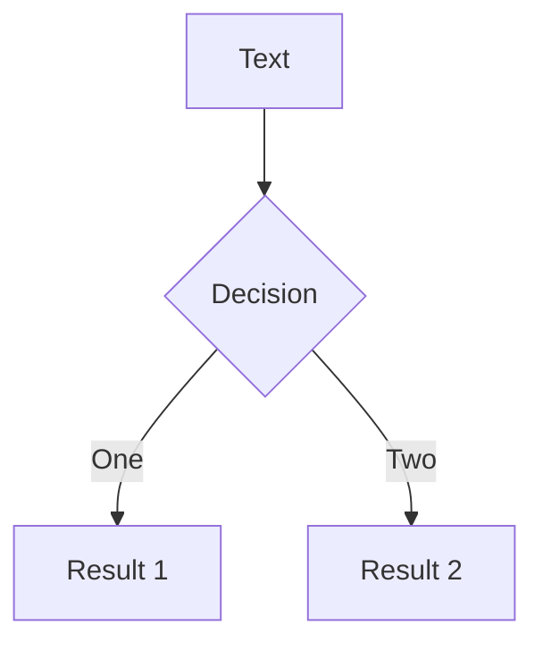

# Slidev
Hello, World!

---

# Page 2

Directly use code blocks for highlights

```ts {0}
console.log('Hello, World!')
```

```ts {2,3|5|all}
function add(
  a: Ref<number> | number,
  b: Ref<number> | number
) {
  return computed(() => unref(a) + unref(b))
}
```

```ts {2|3|7|12} {maxHeight: '100px'}
function add(
  a: Ref<number> | number,
  b: Ref<number> | number
) {
  return computed(() => unref(a) + unref(b))
}
/// ... as many lines as you want
const c = add(1, 2)
```

<Link to="8">Go to slide 8</Link>

---

# code editor

* <logos-vue /> from SVG Logos
* <fontisto-app-store class="text-3xl text-red-400 mx-2" /> fontisto:angelist

```go {monaco}
import "fmt"

fmt.Println("HelloWorld!")
```

<!-- This is a note -->

---
layout: two-cols
---

::default::

# 第 4 页
## 子标题
看看中文的显示效果如何


::right::

> Hello `world`

<style>
blockquote {
  code {
    @apply text-teal-500 dark:text-teal-400;
  }
}
</style>

---
layout: cover
background: 'https://source.unsplash.com/1600x900/?nature,water'
---

# 使用 CSS
You can directly use Windi CSS and Vue components to style and enrich your slides.

<div class="p-3">
  <Tweet id="1001" />
</div>

---
layout: two-cols
---

# Diagrams



::right::
<div class="grid pt-4 gap-4 grids-cols-[100px,1fr]">

### Name

- Item 1
- Item 2

</div>

---

# Click Animations

<!-- Component usage: this will be invisible until you press "next" -->
<v-click>
Hello World
</v-click>

<!-- Directive usage: this will be invisible until you press "next" the second time -->
<div v-click class="text-xl p-2">
Hey!
</div>
<!-- v-after 会在上一个 v-click 触发后使元素可见 -->
<div v-after class="text-xl p-2">Ritchie!</div>

<!-- v-clicks 仅作为组件提供。它可以快速将其子元素全部添加 v-click 指令。它在列表中尤为实用。 -->
<v-clicks>

- Item 1
- Item 2
- Item 3
- Item 4

</v-clicks>

<!-- ：Slidev 会预加载下一张幻灯片以提高性能，这意味着动画可能会在你导航到该页面之前就开始了。为了使其正常工作，你可以禁用指定幻灯片的预加载: preload: fasle 或者使用 v-if -->
<div
  v-if="$slidev.nav.currentPage === 7"
  v-motion
  :initial="{ x: -80 }"
  :enter="{ x: 0 }">
  Slidev
</div>

---

# 导出

```bash
npx slidev export
npx slidev export --format png
```

---

# 静态部署

```bash
npx slidev build
```

生成的应用程序保存在`dist/`目录下，然后可以将目录部署在 Github Pages, Netlify, Vercel

---

# 演讲录制

